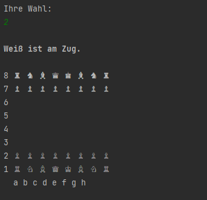
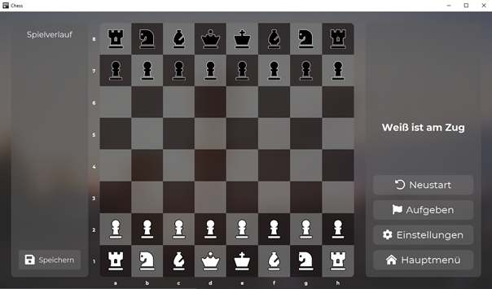

# Schach

Dieses Programm ist ein Schachspiel. Es besteht die Möglichkeit das Spiel gegen eine Person, den Computer oder einen Netzwerk-Spieler zu spielen.
Es gibt zwei Möglichkeiten das Spiel zu starten und zu spielen:

Client:

GUI: 

Eine ausführliche Bedienungsanleitung finden Sie unter Bedienungsanleitung.pdf

Neben dem regulären Schachspiel, nach den allgemeinen Regeln des Weltschachverbands (FIDE) in der deutschen Übersetzung von 2018 (ausgenommen von Sonderregeln), gibt es die folgenden Features:

- Interfacesprache in Deutsch und Englisch
- Spieluhr
- Schachbrett nach jedem Zug drehen
- Schach anzeigen
- Geschlagene Figuren anzeigen
- Mögliche Züge für die Spielfiguren anzeigen
- Spielhistorie

# Maven

Kurzübersicht nützlicher Maven-Befehle. Weitere Informationen finden sich im Tutorial:

* `mvn clean` löscht alle generierten Dateien
* `mvn compile` übersetzt den Code
* `mvn javafx:jlink` packt den gebauten Code als modulare Laufzeit-Image. Das Projekt kann danach gestartet werden mit `target/chess/bin/chess`
* `mvn test` führt die Tests aus
* `mvn compile site` baut den Code, die Dokumentation und die Tests und führt alle Tests, sowie JaCoCo und PMD inklusive CPD aus. Die Datei `target/site/index.html` bietet eine Übersicht über alle Reports.
* `mvn javafx:run` führt das Projekt aus
* `mvn javafx:run -Dargs="--no-gui"` führt das Projekt mit Command-Line-Parameter `--no-gui` aus.
